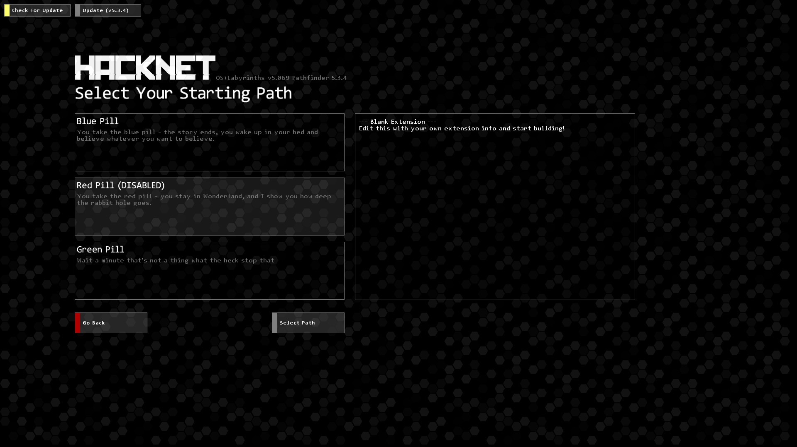
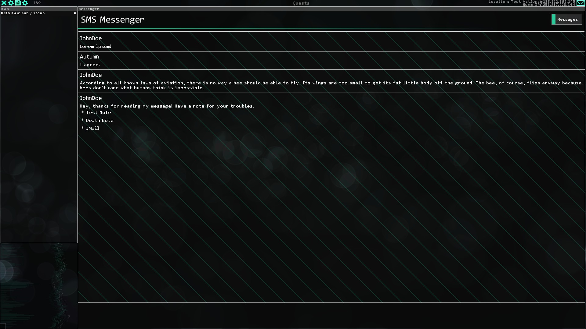
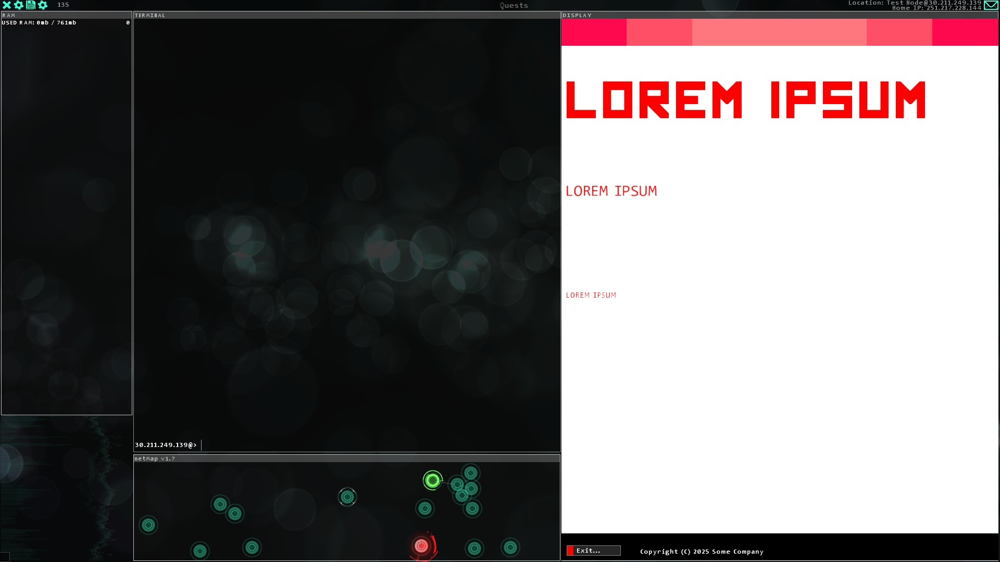
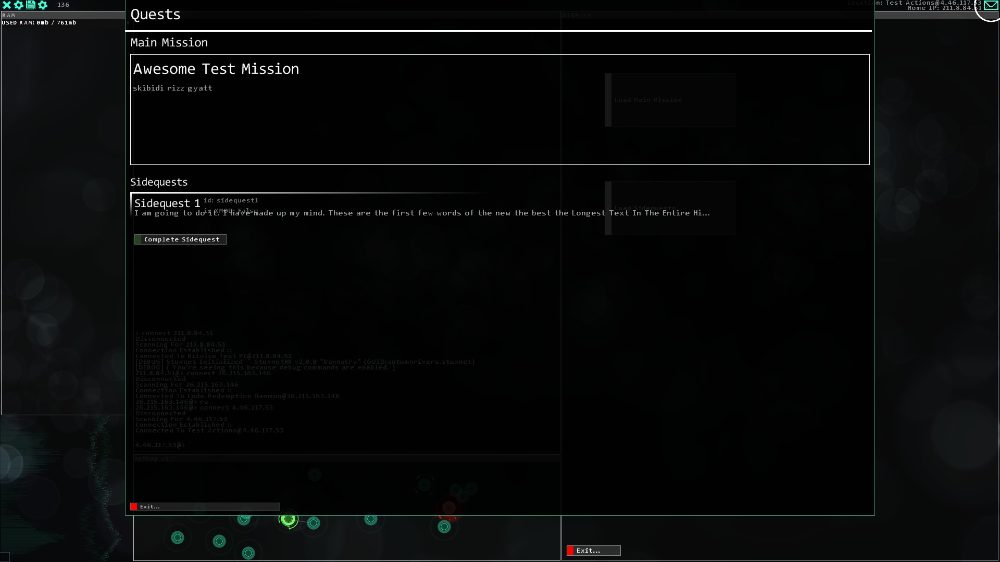

# Stuxnet 2.0
## "WannaCry"
---

# HEY, YOU!
Are you an extension developer that's migrating from Stuxnet 1.4? You should read [the breaking changes list](2.0BreakingChanges.txt), first!

---

# `Stuxnet.Audio`
> **[!] - This is an *opt-in* feature!**  
> To include `Stuxnet.Audio` with your extension, include *both* `StuxnetHN.dll` and `StuxnetHN.Audio.dll` in your `/Plugins` folder.

`Stuxnet.Audio` includes SASS, the `Stuxnet Audio SubSystem`. This system takes advantage of `NVorbis`, a third-party library for loading OGG Vorbis files, allowing extension developers to load custom audio even more dynamically. For example:

## Keep the music going!
SASS includes `StuxnetMusicManager` (SMM), a drop-in replacement for FNA's `MusicManager` class. SMM works very similar to FNA's music system, with one exception - dynamic looping.

Dynamic looping allows extension developers to set a definitive start and end to a music file. When a song reaches the end of the loop, it restarts at the start of the loop. If you're smart, you can use this to create seamless infinite loops of music tracks, and keep the music going without awkward pauses.

For more information, [read here](./Stuxnet.Audio/docs/StuxnetMusicManager.md).

## Custom Sound Effects
SASS also includes the ability to load custom sound effects, or trigger already built-in sound effects! Sounds played this way don't have the ability to loop, but they won't interrupt the music when played.

For more information, [read here](./Stuxnet.Audio/docs/Actions.md#playcustomsound-soundfilestring-).

---

# Animation System
Stuxnet 2.0 includes its own animation system, which is used in one new feature, and helped overhaul an existing feature.

[Read more about the new animation system!](./docs/animations/README.md)

## Animated Themes
No videos. No GIFs. No gimmicks.

Stuxnet 2.0 includes the ability to create animated themes, which are loaded just like vanilla themes. Unlike cutscenes, animations made with this system automatically loop when they reach their end, so it'll feel more vanilla-like. Additionally, images and elements loaded in animated themes are kept in memory until the theme itself is unloaded, so it's much more performant than using `SwitchToTheme`.

You can animate anything from simple objects such as rectangles and images, to advanced fx like the raindrops effect, and a grid effect! (Used in `TorrentStreamInjector`/`RadioV3` and `MemoryForensics`, repsectively.)

[Start making your own!](./docs/animations/AnimatedThemes.md)

## Cutscene Rewrite
Stuxnet 2.0 *also* includes a complete rewrite and overhaul of the cutscene system, using a system very similar to animated themes.

[Learn more here.](./docs/animations/CutsceneFormat.md)

---

# Gamemodes

This new feature allows you to create multiple starting points for your extension. If your extension has multiple paths, you could allow players to start on a certain path. You could even technically fit an entirely new extension in with this feature!

Is also compatible with the [Persistence feature](#persistence), so you can lock certain entries behind a persistent flag.

[Read more here!](./docs/StuxnetConfig.md#gamemode)

---

# SMS/Messenger
New plugin, who dis?

The Messenger feature (aka SMS) acts as a sort of global IRC that also includes system messages, choices, and running actions when a message is read!

For more information, [read the documentation!](./docs/sms/SMSBasics.md)

---

# BYOD (Build Your Own Daemon)

BYOD is XML-based static daemon creation. That's right, XML-based. No C# knowledge required!

BYOD daemons, however, can only be static. Sorry, but you can't have animations in this! However, you can have buttons, which run actions that you specify when clicked. You could flash the screen, run a cutscene, play a sound effect, anything you can think of - so long as it can be put in an action file!

For more information, [read the documentation!](./docs/byod/BYOD_README.md)

---

# `Stuxnet.Quests`
A new hand touches the beacon.

`Stuxnet.Quests` is a very cool parallel missions system that gives you a pretty neat-looking GUI to manage said missions. (Is also compatible with XMOD!)

[Read more here!](./docs/Quests.md)

---

# Persistence
Eureka!

Stuxnet 2.0 introduces persistence, similar to how [Ren'Py does it](https://www.renpy.org/doc/html/persistent.html). This is data that's kept individual of any save file, therefore allowing you to carry data across different saves.

[Read more here!](./docs/Actions.md#persistence)

---

# Misc. Changes
## Localizer
Stuxnet 2.0 onwards includes its own localizer for terms relating to Stuxnet features. This is entirely extensible, and it's very easy to write your own localizations!

[Check out the localization template](./StuxnetLocalizations/template.json).

## Force Exit Game
[Does what it says on the tin.](./docs/Actions.md#forceclosegame-)

## Fullscreen Credits
More immersive credits. [Read more here.](./docs/Actions.md#fullscreen-credits)