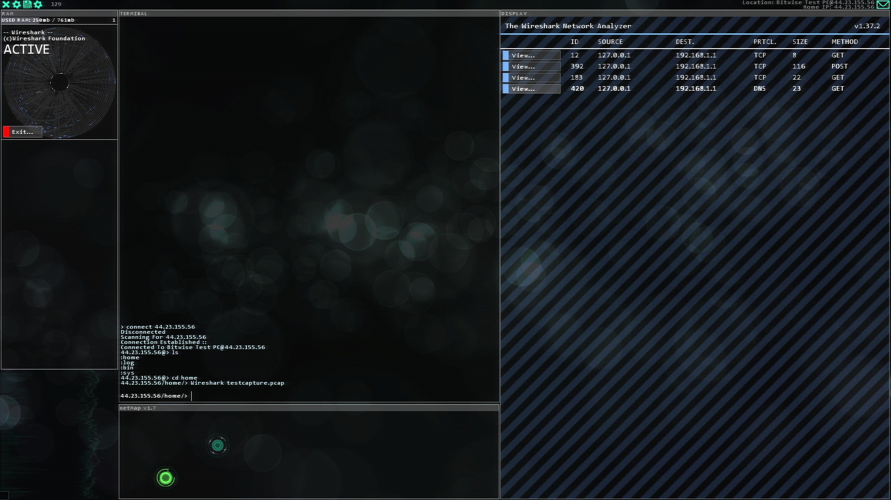
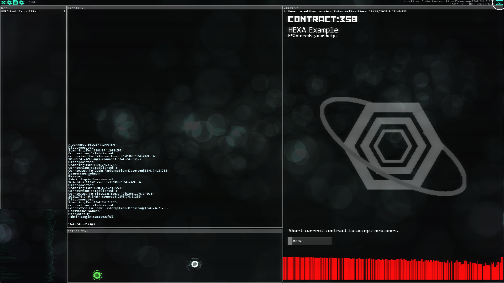



<h1>Stuxnet</h1>

Your all-in-one Hacknet: Extensions mod.

---

## W.T.F. (What The FTPSprint) is Stuxnet?
Depends on the context. This Stuxnet, the one you're looking at, is a Pathfinder mod for Hacknet that adds all sorts of goodies for extension developers to use.

Outside of this context, [Stuxnet](https://en.wikipedia.org/wiki/Stuxnet) is widely considered to be the first "cyber weapon," affecting machines in real life, rather than only doing digital damage.

## Who can use it?
**Anyone!** (as long as they have Hacknet: Labyrinths installed...)

Yeah, the mod uses some assets from Labyrinths. Certain things would break if Labyrinths were not installed.

All I ask in return, if you do use this in your extensions, *please* be sure to credit me!

## Well, what does it add?
Read on to find out. Impatient!

---

For new daemons and actions, refer to the [docs folder](./docs/).

---

## New Executables
### `RadioV3` / `#RADIO_V3#`

Gone are the days of listening to the same song on repeat during a long mission, gone are the days of `SongChangerDaemon`, and gone are the days of `Tuneswap`!

**RadioV3** is the next evolution in extension music - players unlock new songs by going through the extension, or by entering codes. You can also deny radio access to the player at any time - in the case of things like cutscenes.

Get your golden funky groove on and grab yourself a copy of **RadioV3**!

### `Wireshark` / `#WIRESHARK_EXE#`

Based off of the [real-life program of the same name](https://www.wireshark.org/), Wireshark allows you to capture network traffic on certain nodes. It works similarly to `MemForensics`. Wireshark can also be used to "capture" packets on certain nodes by passing `--capture` to the executable. Admin access is required to capture traffic.

Please refer to [this example file](./docs/examples/wireshark_pc_example.xml) for more information.

---

## Patches / Features
### Mission Logos

Shows a logo for the target client in the mission. This has some prerequisites:

1. The `client` attribute of your mission's `posting` tag *must* be non-empty. Example:
    * `<posting title="HEXA Example" client="HEXA">HEXA needs your help!</posting>`
    * In this case, `HEXA` is the `client`.
2. You must have an associated image in the `/Images` folder of your extension, with the same name as the client. Case-sensitive.
    * This will show a logo for HEXA: `/Images/HEXA.png`
    * This will not: `/Images/hexa.png`
3. Your mission **must** be in a `MissionHubServer`. There's no support for Entropy-style or DHS daemons yet.

---

# LICENSE
MIT License

Copyright (c) 2023 Autumn Rivers

Permission is hereby granted, free of charge, to any person obtaining a copy
of this software and associated documentation files (the "Software"), to deal
in the Software without restriction, including without limitation the rights
to use, copy, modify, merge, publish, distribute, sublicense, and/or sell
copies of the Software, and to permit persons to whom the Software is
furnished to do so, subject to the following conditions:

The above copyright notice and this permission notice shall be included in all
copies or substantial portions of the Software.

THE SOFTWARE IS PROVIDED "AS IS", WITHOUT WARRANTY OF ANY KIND, EXPRESS OR
IMPLIED, INCLUDING BUT NOT LIMITED TO THE WARRANTIES OF MERCHANTABILITY,
FITNESS FOR A PARTICULAR PURPOSE AND NONINFRINGEMENT. IN NO EVENT SHALL THE
AUTHORS OR COPYRIGHT HOLDERS BE LIABLE FOR ANY CLAIM, DAMAGES OR OTHER
LIABILITY, WHETHER IN AN ACTION OF CONTRACT, TORT OR OTHERWISE, ARISING FROM,
OUT OF OR IN CONNECTION WITH THE SOFTWARE OR THE USE OR OTHER DEALINGS IN THE
SOFTWARE.
