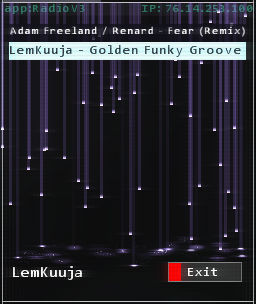

<h1>Stuxnet</h1>

Your all-in-one Hacknet: Extensions mod.

---

## W.T.F. (What The FTPSprint) is Stuxnet?
Depends on the context. This Stuxnet, the one you're looking at, is a Pathfinder mod for Hacknet that adds all sorts of goodies for extension developers to use.

## Well, what does it add?
Read on to find out. Impatient!

---

For new daemons and actions, refer to the [docs folder](./docs/).

---

## New Executables
### `RadioV3` / `#RADIO_V3#`

Gone are the days of listening to the same song on repeat during a long mission, gone are the days of `SongChangerDaemon`, and gone are the days of `Tuneswap`!

**RadioV3** is the next evolution in extension music - players unlock new songs by going through the extension, or by entering codes. You can also deny radio access to the player at any time - in the case of things like cutscenes.

Get your golden funky groove on and grab yourself a copy of **RadioV3**!