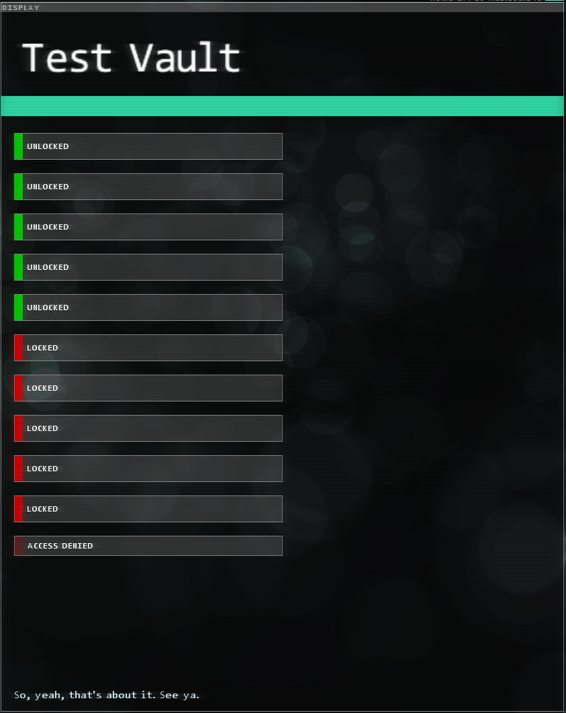

<h1>Stuxnet.Daemons</h1>

---

# Code Redemption Daemon
### `<CodeRedemptionDaemon CodePrefix="string" Message="string"/>`

A daemon for accepting codes inputted by the user. These codes can be anywhere as long as they're defined [in the codes file](./StuxnetFiles.md#codes-file). They can be in the extension, or out of it. It doesn't matter. You could also use this as a cheat tool for debugging if you associate a code with, say, a bunch of executables.

Shows the extension's logo as defined in `ExtensionInfo.xml`.

* `CodePrefix` - A string indicating what prefix to put behind the displayed user input. If omitted, it will not display a prefix.
* `Message` - The server message. Displays `Enter your code here...` if omitted.

# Debug Daemon
### `<DebugDaemon RequiredPassword="string" />`

A daemon that makes it so the user can't connect to it if they don't have debug commands enabled. Additionally, you can require the player's save file to have a certain password for extra protection. Use this for your Cheater's Stash!

* `RequiredPassword` - **OPTIONAL.** If set, the player's save file password must match the daemon's set password. Otherwise, it's treated as if though they don't have debug mode enabled.

# Vault Daemon
### `<VaultDaemon Name="string" KeyName="string" [MaximumKeys="int" Message="string"] />`

Ported from LunarOSPathfinder, but works very differently. Unlike tracking user flags (as is done in LunarOSv3), the Stuxnet version of the vault daemon keeps track of its own internal list of received keys. This means you can't have specific keys laying around, but it's much easier to keep track of it.

For use with the [Vault Actions](./Actions.md#vault-actions).

* `Name` - The name of the vault. Shows in big words on the connection screen. Technically optional, but I doubt you want "TsukiVault" showing up in your extension.
* `KeyName` - **REQUIRED. The game WILL throw an error if you omit this!** The name of the key to keep track of. You'll use this in your actions, so be sure to keep it unique.
* `MaximumKeys` - Optional, defaults to 5. The amount of keys the user must collect. You can have a maximum of 10 keys, and a minimum of 1 key.
* `Message` - A message to show at the bottom of the screen. Again, *technically* optional, but you should really set something.