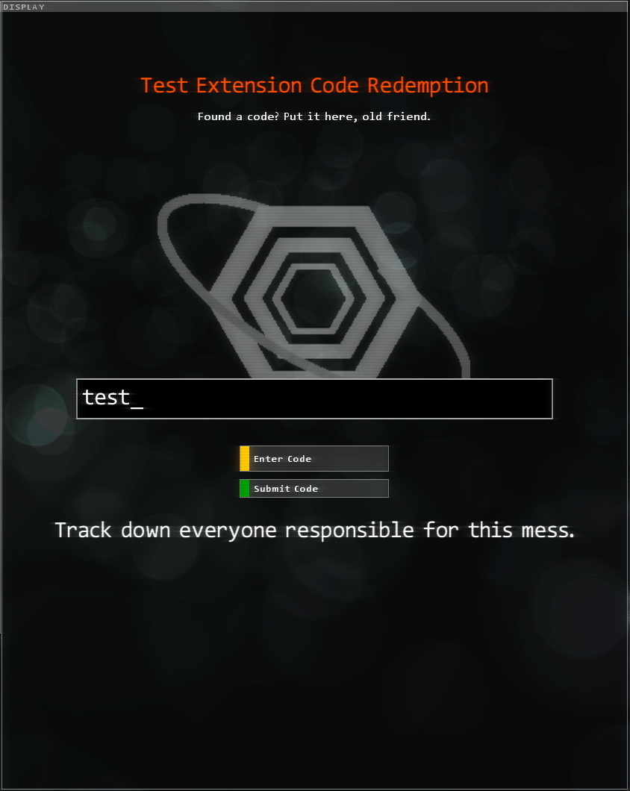
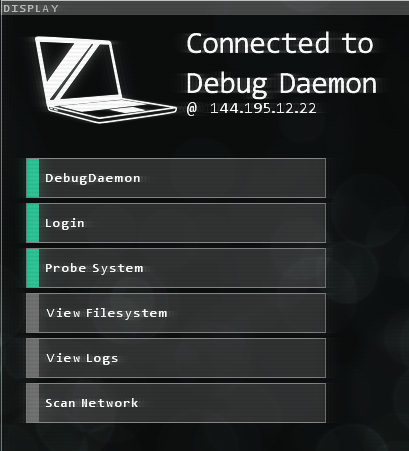

<h1>Stuxnet.Daemons</h1>

---

# Code Redemption Daemon
### `<CodeRedemptionDaemon CodePrefix="string" Message="string"/>`

A daemon for accepting codes inputted by the user. These codes can be anywhere as long as they're defined [in the codes file](./StuxnetFiles.md#codes-file). They can be in the extension, or out of it. It doesn't matter. You could also use this as a cheat tool for debugging if you associate a code with, say, a bunch of executables.

Shows the extension's logo as defined in `ExtensionInfo.xml`.

* `CodePrefix` - A string indicating what prefix to put behind the displayed user input. If omitted, it will not display a prefix.
* `Message` - The server message. Displays `Enter your code here...` if omitted.

# Debug Daemon
### `<DebugDaemon RequiredPassword="string" />`

A daemon that makes it so the user can't connect to it if they don't have debug commands enabled. Additionally, you can require the player's save file to have a certain password for extra protection. Use this for your Cheater's Stash!

* `RequiredPassword` - **OPTIONAL.** If set, the player's save file password must match the daemon's set password. Otherwise, it's treated as if though they don't have debug mode enabled.