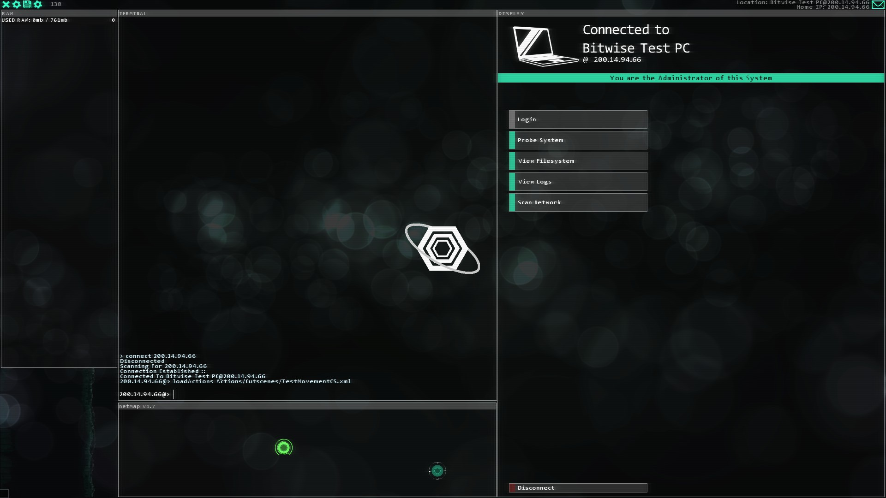

# Let's make a cutscene!
For more information about cutscenes, [read here](./What_Are_Cutscenes.md).

---

Cutscenes are made similar to actions, but also not similar to actions. Cutscenes need any and all objects (typically rectangles and images) related to it to be registered beforehand, and instructions and registers must be separate. This is what a typical cutscene file looks like:
```xml
<StuxnetCutscene id="imgTest">

    <RegisterObjects>
        <Image id="img1" path="Images/Radar.png" size="0.15,0.15" />
    </RegisterObjects>

    <Instructions>
        <ShowImage id="img1" delay="0.1" />
        <MoveImage id="img1" pos="0.1,0.1" tween="false" delay="2.0" />
        <MoveImage id="img1" pos="0.2,0.4" tween="true" tweenDuration="3.0" delay="5.0" />
        <DelayEnding delay="20.0" />
    </Instructions>

</StuxnetCutscene>
```

Woah, that's a lot of data! Let's break this down...
```xml
<StuxnetCutscene id="string" [delayHost="string"]>

    <RegisterObjects>
        <Rectangle id="string" size="float,float" />
        <Image id="string" path="string" size="float,float" />
    </RegisterObjects>

    <Instructions>
        <!-- Instructions here... -->
    </Instructions>

</StuxnetCutscene>
```

Let's get the general layout. We'll need an ID for the cutscene, and optionally, a delay host ID. If the delay host ID is left blank, it'll default to simply `delay`. We'll set the ID for this cutscene to `testcs`.
```xml
<StuxnetCutscene id="testcs" delayHost="delay">

    <RegisterObjects>
    </RegisterObjects>

    <Instructions>
    </Instructions>

</StuxnetCutscene>
```

So, before anything can even be *done* in a cutscene, it must register a rectangle or an image. Let's register a rectangle and the extension's logo:
```xml
<StuxnetCutscene id="testcs" delayHost="delay">

    <RegisterObjects>
        <Rectangle id="rect1" size="0.1,0.1"/>
        <Image id="logo" path="Logo.png" size="0.15,0.15"/>
    </RegisterObjects>

    <Instructions>
    </Instructions>

</StuxnetCutscene>
```

Objects are hidden when they are registered, so you'll need to manually make them visible. This also gives you the opportunity to move them around beforehand, though. Let's show the extension logo in the middle of the screen:
```xml
<StuxnetCutscene id="testcs" delayHost="delay">

    <RegisterObjects>
        <Rectangle id="rect1" size="0.1,0.1"/>
        <Image id="logo" path="Logo.png" size="0.15,0.15"/>
    </RegisterObjects>

    <Instructions>
        <MoveImage id="logo" pos="0.5,0.5" tween="false" delay="0.0" />
        <ShowImage id="logo" delay="0.1"/>
    </Instructions>

</StuxnetCutscene>
```

And for one final touch, let's delay the ending of the cutscene so it ends at five seconds:
```xml
<StuxnetCutscene id="testcs" delayHost="delay">

    <RegisterObjects>
        <Rectangle id="rect1" size="0.1,0.1"/>
        <Image id="logo" path="Logo.png" size="0.15,0.15"/>
    </RegisterObjects>

    <Instructions>
        <MoveImage id="logo" pos="0.5,0.5" tween="false" delay="0.0" />
        <ShowImage id="logo" delay="0.1"/>
        <DelayEnding delay="5.0"/> <!-- ⬅️ -->
    </Instructions>

</StuxnetCutscene>
```

Great, we have a working cutscene! 🥳 Well, sort of. It's a *valid* cutscene, but it won't register or trigger itself. We'll have to do that. If you haven't already, it's recommended to create a `Cutscenes` folder in your extension folder to store all your cutscene files. For sake of example, we'll say our WIP cutscene file is titled `TestCutscene.xml` and is in the aforementioned folder.

In your starting actions for your extension, register the cutscene, like so:
```xml
<RegisterStuxnetCutscene FilePath="Cutscenes/TestCutscene.xml" />
```

Fantastic! We can now trigger the cutscene. Trigger the cutscene with its ID anywhere in your extension via this action:
```xml
<TriggerStuxnetCutscene CutsceneID="testcs" />
```

Alright, now let's hop on over to Hacknet and see the result of our work.


And it works! Woohoo! The image might look a little small, so feel free to change its `size` as you wish. In the meantime, let's move it around using tweens;
```xml
<StuxnetCutscene id="testcs" delayHost="delay">

    <RegisterObjects>
        <Rectangle id="rect1" size="0.1,0.1"/>
        <Image id="logo" path="Logo.png" size="0.15,0.15"/>
    </RegisterObjects>

    <Instructions>
        <MoveImage id="logo" pos="0.5,0.5" tween="false" delay="0.0" />
        <ShowImage id="logo" delay="0.1"/>
        <MoveImage id="logo" pos="0.35,0.75" tween="true" tweenDuration="2.0" delay="3.0"/>
        <MoveImage id="logo" pos="0.8,0.475" tween="true" tweenDuration="3.0" delay="5.5"/>
        <DelayEnding delay="10.0"/>
    </Instructions>

</StuxnetCutscene>
```

And voila, you've got yourself a working cutscene. Pat yourself on the back. You deserve it.

For more information on all the instructions you can do, [check the Instructions list](./Cutscene_Instructions.md).

**REMEMBER**; only one cutscene can be loaded at a time. If you attempt to load a cutscene while one is currently running, the game *will* ignore it!